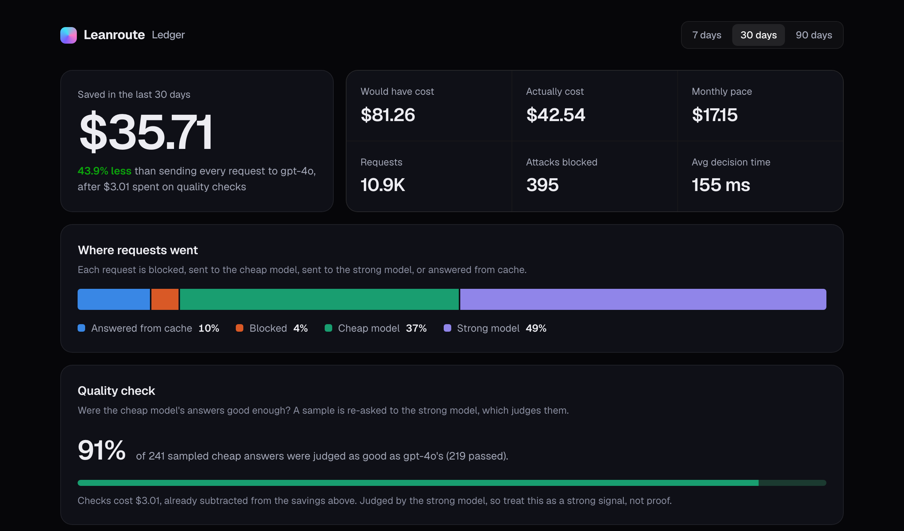

# Leanroute

**An open-source toll gate in front of your LLM.** It blocks prompt injections, sends each request to a cheap model when the cheap model's answer will be good enough, and proves the savings on your own dashboard.

[](https://github.com/kdandu001-arch/leanroute/actions/workflows/ci.yml)
[](https://pypi.org/project/leanroute/)
[](https://pypi.org/project/leanroute/)
[](LICENSE)

Website: **[leanroute.online](https://leanroute.online)** · Results: **[eval/results.md](eval/results.md)** · Changelog: **[CHANGELOG.md](CHANGELOG.md)**

## Quickstart

```bash
pip install "leanroute[local]"
```

```python
from openai import OpenAI
from leanroute import Leanroute

client = Leanroute().wrap(OpenAI(), cheap="gpt-4o-mini", strong="gpt-4o")
r = client.chat.completions.create(model="auto", messages=[{"role": "user", "content": "Capital of Australia?"}])
print(r.choices[0].message.content, r.leanroute.route)   # -> Canberra  cheap
```

Or run it as an OpenAI-compatible server and change one line in any app: `base_url="http://localhost:8000/v1"`, `model="auto"` ([server setup](#run-it-on-your-mac)).


<sub>The savings dashboard, shown with sample data.</sub>

## Why Leanroute

| | What it does | Measured ([how](eval/results.md)) |
|---|---|---|
| **Routes by answer quality** | A router trained on 109k real prompts with GPT-4-graded answers predicts whether a cheap model's answer will be good enough | With half of traffic sent to the cheap model, **94%** of those answers were good enough (89% with Laya's difficulty score) |
| **Guards without blocking users** | An open-source prompt-injection detector stops attacks before any tokens are billed | **0.4%** of normal requests and **0%** of coding requests wrongly blocked |
| **Proves the savings** | A sample of cheap answers is re-checked against the strong model; the check's cost is subtracted from savings | Pass rate on your dashboard |
| **Production basics** | Streaming, retries, cheap→strong fallback, response cache, per-project budgets and rate limits | 54 automated tests |
| **Yours** | Apache 2.0, self-hosted, prompts never stored | |

```
your app ─► Leanroute ─┬─► blocked (prompt injection) ... $0
                       ├─► answered from cache .......... $0
                       ├─► cheap model .................. $
                       └─► strong model ................. $$$
```

Also: [Laya](https://huggingface.co/convaiinnovations/laya) answers simple decisions directly ("spam?", "which team?", "hot lead?") with a probability and no LLM at all, through `/v1/decide` or `lr.check()`.

## What's in the repo

| Folder | What it is |
|---|---|
| `sdk/` | **The `leanroute` Python package.** Install it in any project to put Laya in front of your LLM (`pip install leanroute`). |
| `server/` | FastAPI API: `/v1/decide`, `/v1/templates`, OpenAI-compatible `/v1/chat/completions` gateway, `/v1/stats`. Also serves the website at `/`. |
| `web/` | The website: landing page, live Playground, savings calculator, docs, pricing. One static file. |
| `examples/` | Drop-in OpenAI example, any-LLM routing, no-LLM decisions. |

## Use it in any project (SDK)

```bash
pip install "leanroute[local]"        # Laya runs inside your app
# or: pip install leanroute           # and point it at a Leanroute server
```

```python
from openai import OpenAI
from leanroute import Leanroute

lr = Leanroute()                                       # or Leanroute(api_url="http://localhost:8000")
client = lr.wrap(OpenAI(), cheap="gpt-4o-mini", strong="gpt-4o")
r = client.chat.completions.create(model="auto", messages=[{"role": "user", "content": "Hi!"}])
print(r.leanroute.route)                               # "cheap" | "strong"   (blocked prompts raise leanroute.Blocked)
```

Full SDK docs: [`sdk/README.md`](sdk/README.md). On PyPI: [pypi.org/project/leanroute](https://pypi.org/project/leanroute/).

## Run it on your Mac

```bash
cd server
python3 -m venv .venv && source .venv/bin/activate
pip install -r requirements-dev.txt
cp .env.example .env            # edit values if you like
uvicorn app.main:app --port 8000 --env-file .env   # --env-file loads your settings from .env
```

The first start downloads the Laya weights from Hugging Face (about 1-2 GB) and preloads them. Then open `http://localhost:8000/docs` for the interactive API docs.

Want the UI without the model? `LEANROUTE_ENGINE=mock uvicorn app.main:app --port 8000 --env-file .env` runs a keyword stand-in that returns the same response shape. Its responses are labelled `"engine": "mock"`; it is **not** Laya and its numbers mean nothing.

Then open **http://localhost:8000**: the server also serves the website, and the Playground connects to it automatically (green **Live API** badge).

Run the tests: `cd server && pytest -q` and `cd sdk && pytest -q`

## API

### `POST /v1/decide`

```bash
curl localhost:8000/v1/decide -H 'Content-Type: application/json' -d '{
  "template": "scam_check",
  "text": "USPS: unpaid $1.99 fee, pay within 24h: usps-redelivery-help.co/pay"
}'
```

Or bring your own questions:

```json
{
  "text": "Refund the duplicate charge or we cancel.",
  "questions": {
    "churn_risk": {"type": "noul", "instructions": "Might the customer cancel?"},
    "intent": {"type": "choice", "instructions": "What do they want?",
               "criteria": {"refund": "money back", "help": "support", "other": "anything else"}}
  }
}
```

Question types: `noul` (yes/no probability), `choice` (one of a few options), `score` (a level on a scale).
Templates: `scam_check`, `ticket_routing`, `email_triage`, `lead_score`, `guardrails`, `moderation`, `model_router`.

### `POST /v1/chat/completions` (LLM Cost Cutter)

Drop-in OpenAI-compatible endpoint. Send `model: "auto"` and Leanroute:

1. blocks prompt-injection attempts before any LLM is paid (no cost). The default guard (`GUARD_MODE=precise`) uses ProtectAI's open-source injection detector, which in testing almost never blocked a normal request; `broad` also uses Laya to catch more role-play jailbreaks, at the price of blocking some coding requests (see [`eval/results.md`](eval/results.md)),
2. predicts whether the cheap model's answer will be good enough, using Leanroute's own router (trained on 109k real prompts whose cheap-model answers GPT-4 graded; `ROUTER=laya` uses Laya's difficulty score instead), and asks Laya whether the request is sensitive (money, legal, medical, safety),
3. sends requests the cheap model can handle, and that aren't sensitive, to `CHEAP_MODEL`,
4. sends everything else to `STRONG_MODEL`.

The response includes a `leanroute` block (`route`, `reason`, `cost_usd`, `saved_usd`) and `X-Leanroute-Route` / `-Model` / `-Reason` headers. `GET /v1/stats` shows totals and % saved versus sending everything to the strong model. Pin a specific model name to skip routing and keep only the guardrail.

* **Streaming** (`stream: true`) passes the provider's answer through as it's written; cost is recorded when the stream ends.
* **Retries and fallback:** provider overload (429), server errors (5xx) and network failures are retried; if the cheap model still fails, the request goes to the strong model instead of failing (for streams, before the first byte).
* **Budgets and rate limits per project:** `LEANROUTE_BUDGETS=acme:50` caps a project's monthly spend and `PROJECT_RPM` its requests per minute. Both are checked before the LLM is called, so an over-budget request costs nothing (HTTP 429).

### Response cache

Set `CACHE_TTL_SECONDS` (e.g. `3600`) and identical requests (same project, same messages and settings) are answered from storage for $0, skipping both Laya and the LLM. Off by default, since some apps want a fresh answer every time. **While it's on, LLM responses are stored**; prompts are stored only as a one-way hash. Blocked requests are never cached.

### Quality check: proof the savings are real

Most routers claim savings but never check whether the cheap model's answers were good enough. Set `QUALITY_CHECK_RATE=0.05` and Leanroute re-asks 5% of cheap-routed requests to the strong model in the background, then has the strong model judge whether the cheap answer was as good. The dashboard shows the pass rate (e.g. "91% of 271 sampled cheap answers were judged as good as gpt-4o's") and **subtracts what the checks cost from your savings**. Only pass/fail and cost are stored. The judge is the strong model itself, so treat the pass rate as a strong signal, not proof.

### Savings dashboard (Leanroute Ledger)

Open **http://localhost:8000/dashboard** to see what the gateway saved you: money saved, % saved, what it would have cost on the strong model, monthly pace, routing split, attacks blocked, and a per-day chart.

* Usage is saved to a small SQLite file (`server/data/leanroute.db`, or `LEANROUTE_DB`), so numbers survive restarts. **Only counts and costs are stored, never prompt text.**
* Give each customer their own dashboard with project-named keys: `LEANROUTE_API_KEYS=acme:lr_abc,beta:lr_def`. Each key sees only its own project.
* The same data is available as JSON: `GET /v1/usage?days=30` (and all-time totals at `GET /v1/stats`).
* Using only the Python package, no server? Run **`leanroute dashboard`**: the same page, built from the usage the package saves on your computer (`~/.leanroute/usage.db`).

Works with any OpenAI-compatible upstream (OpenAI, OpenRouter, Groq, Together, a local Ollama at `http://localhost:11434/v1`). **Set the price variables in `.env` to your provider's current prices**; savings are only as accurate as those numbers.

## Deploy for $0

**API: Oracle Cloud Always Free (ARM VM, 2 OCPU / 12 GB RAM as of Aug 2026).**
1. Create an Ubuntu Ampere A1 instance, open port 8000 (or put Caddy in front for HTTPS).
2. Install Docker, clone this repo, then:
   ```bash
   cd server && cp .env.example .env   # set LEANROUTE_API_KEYS and CORS_ORIGINS!
   docker compose up -d --build
   ```
3. Expect a few hundred ms per decision on CPU. That's fine for a Playground and moderate traffic. Move to a GPU when you need ~35 ms.

Alternative for demos: run on your Mac and expose it with a free Cloudflare Tunnel (`cloudflared tunnel --url http://localhost:8000`). It's only online while your Mac is.

**Website: Cloudflare Pages (free, commercial use allowed).**
1. Set `window.LEANROUTE_API` in `web/index.html` to your API URL.
2. Cloudflare dashboard → Pages → connect the GitHub repo → build output directory `web`, no build command.
3. You get `https://<name>.pages.dev`. Add a custom domain later if you want.

**Before going public:** set `LEANROUTE_API_KEYS`, lock `CORS_ORIGINS` to your site, keep `PLAYGROUND_RPM` low.

## Honest limits

* Laya **decides**; it doesn't write. Summaries, answers and chat stay with the LLM.
* Short text only: roughly a page per call (`MAX_INPUT_CHARS`, default 4,000).
* Keep choice questions to a handful of options.
* **Measured accuracy, honestly.** On held-out labelled prompts from public datasets ([`eval/results.md`](eval/results.md)): the default guard wrongly blocks **0.4%** of normal requests and **no coding or math requests**, but catches only about **36%** of subtle injection attacks (many in German; the detector is English-only). The guard is a first line of defence, not a complete one. Routing, measured on 10,000 held-out prompts with GPT-4-graded answers: at the default setting Leanroute's router sends about half of traffic to the cheap model, and **94% of those answers were good enough** (vs. about 89% using Laya's difficulty score, which was close to random). A clear improvement, not a solved problem; turn on the quality check to see how cheap answers hold up on your own traffic. Re-run the evaluation yourself: `python eval/build_dataset.py && python eval/score.py && python eval/score_protectai.py && python eval/train_router.py && python eval/report.py`.
* Base checkpoints are weak zero-shot on niche domains and ship over-confident. For production, **fine-tune on your own labelled examples and fit a temperature** (see the Laya model card). Start with conservative thresholds and keep a human in the loop for high-stakes actions.

## Roadmap

- [ ] Hosted Leanroute Pro ($19/month): no server to run
- [ ] API keys + usage in Supabase, Stripe billing
- [x] Streaming in the gateway
- [x] Retries, fallback to the strong model, per-project budgets and rate limits
- [x] Response cache for repeated prompts
- [x] Quality check: verify a sample of cheap answers against the strong model
- [ ] Fine-tune Studio: upload CSV → custom calibrated model
- [x] Savings dashboard page
- [ ] Dashboard for SDK users (SDK reports usage to a server)
- [x] MCP server (`leanroute mcp`)
- [ ] LangChain / CrewAI plug-ins

## License

Leanroute is free and open source under Apache 2.0, © 2026 Kushal. See [`LICENSE`](LICENSE) and [`NOTICE`](NOTICE).

Built on Laya (weights and package: Apache 2.0, © Convai Innovations), which is downloaded at install time and not included in this repo.
